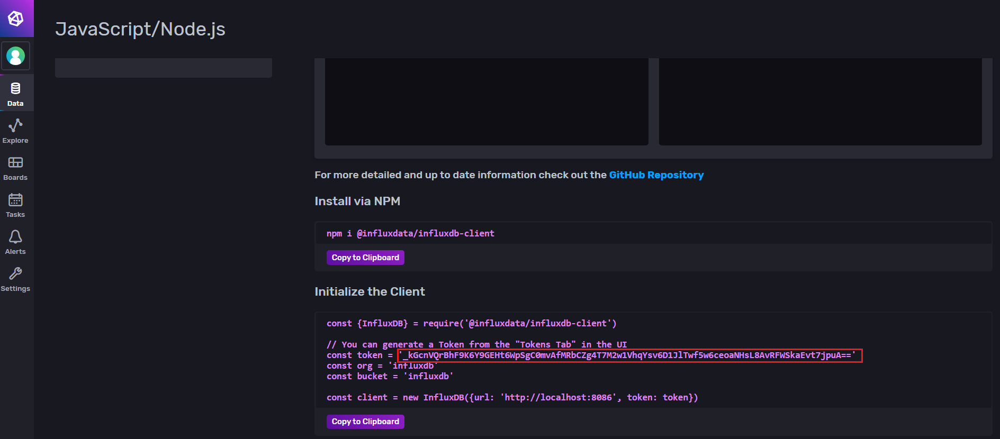
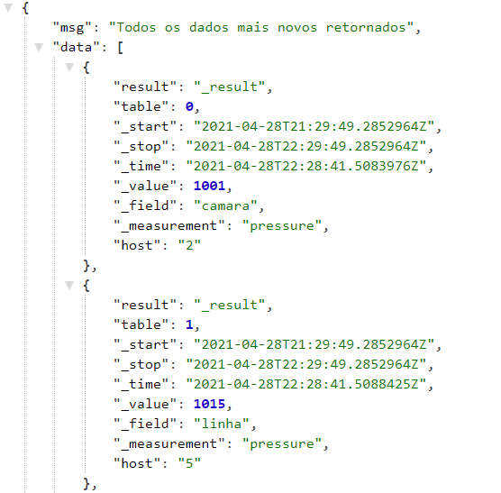

# Backend pi2
## Pré Requisitos do Sistema
1. Instalação do [Docker](https://docs.docker.com/engine/installation/)
2. Instalação do [Docker Compose](https://docs.docker.com/compose/install/)
3. Clone o repositório usando o comando:
```
git clone https://github.com/fga-eps-mds/2020.1-Conecta-Ensina-Backend.git
```
## Inicializando
1. Crie e inicie os containers dos serviços:

```
docker-compose build
docker-compose up
```

2. Ao terminar de usar os serviços, user o seguinte comando para pará-los:
```
docker-compose down
``` 
## Como utilizar
1. Acesse o InfluxDB atraves da porta 8086 do seu navegador: [http://localhost:8086]() 

2. Informe os dados cadastrais, deixando o nome da organização e bucket como **influx** e depois em **configure later**.

3. Vá para a aba Data no canto esquerdo;

4. Clique em JavaScript/Node.js

5. Copie o token informado como na imagem abaixo:
<p align="center"> </p>

6. Crie um arquivo .env com port = 8001 e token = o token copiado anteriormente

7. Com isso já pode utilizar as rotas da API após interromper e subir novamente o docker.

## Rotas da API
### Sensores
#### rotas GET
1. http://localhost:8001/sensor/index : Retorna um array contendo o último dado de cada sensor

2. http://localhost:8001/sensor/getmeans : retorna a média obtida pelos sensores separadas por local

3. http://localhost:8001/sensor/:id : retorna o dado mais novo de determinado sensor informado pelo id na rota

Todos os dados retornados estão no formato abaixo:
<p align="center"> </p>
    No qual:<br>

    host: corresponde ao id do sensor  
    _time: é a hora em que foi medido,
    _field: é o local onde foi medido
    _measurement: é o tipo do sensor(o que ele mede)
    _value: é o valor obtido por determidado sensor
    
Os demais não são dados relevantes

#### Rota POST
1. http://localhost:8001/sensor/newpoints : cadastra novos dados de sensores.

Ela requer um json no seguinte formato:
```
{
    "datas": [{
            "id": 1,
            "type": "temperature",
			"field": "camara",
            "value": 22.1
         }, {
            "id": 2,
            "type": "pressure",
			"field": "linha",
            "value": 1001
        }
    ]
}
```
Podendo receber dados adquiridos de um ou mais sensores.

### Experimentos
#### Rotas GET

1. http://localhost:8001/control/index : Retorna um array contendo todos os experimentos cadastrados

2. http://localhost:8001/control/:id : retorna os dados de um determinado experimento informado pelo id na rota

#### Rotas POST
1. http://localhost:8001/control/start : cadastra um novo experimento.

Ela requer um json no seguinte formato:
```
{
    "tempMax": 60,
    "timeTempMax": 5,
    "tempMin": -20,
	"timeTempMin": 5,
	"qtdeCiclesMax": 1,
	"qtdeCiclesMin": 1
}
```
Recebendo os parametros do experimento que se deseja cadastrar.

2. http://localhost:8001/control/finish/:id : Finaliza o experimento informado pelo id.

2. http://localhost:8001/control/abort/:id : Realiza uma parada de emergência no experimento informado pelo id.